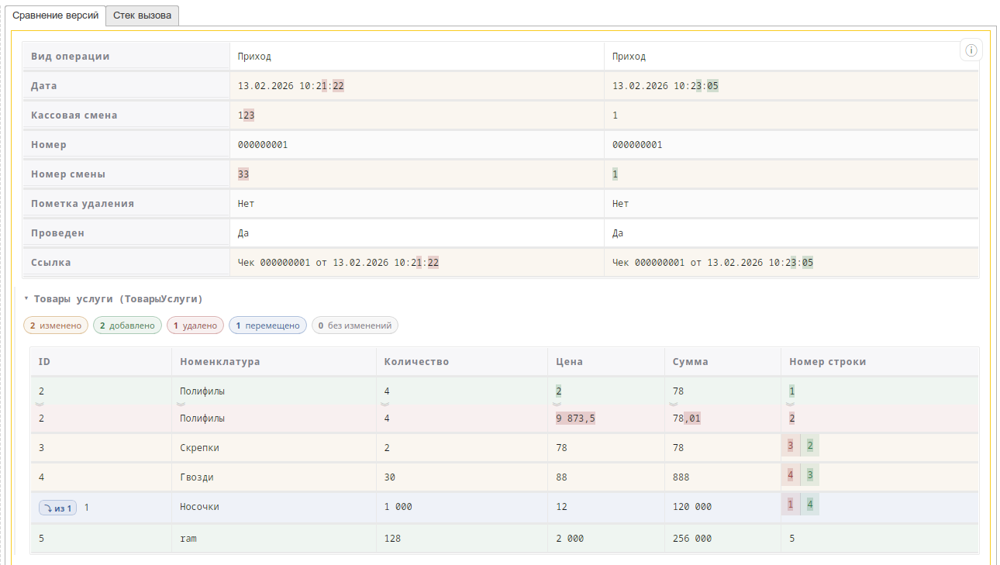
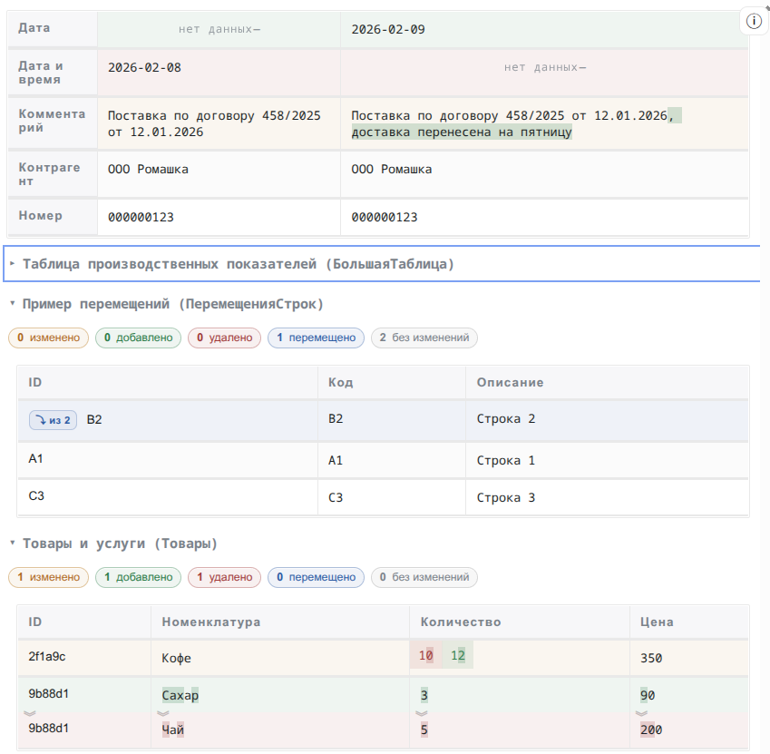

# Diff-View

Встраиваемый веб-компонент для визуального сравнения данных в `1С:Предприятие 8`:

- Объекты;
- табличные части (сопоставление строк, добавления/удаления/изменения);
- JSON и вложенные структуры;
- подсветка изменений внутри значений.



Проект ориентирован на использование внутри инструментов тестирования и анализа для 1С.

## Ограничения использования

- Windows: `1С:Предприятие 8` версии 8.3.14+.
- Linux: `1С:Предприятие 8` версии 8.3.24+.

## Использование в проектах

- Используется: [RAT](https://github.com/bia-technologies/rat)
- Планируется использование: [YAxUnit](https://github.com/bia-technologies/yaxunit)
- Планируется использование: [edt-test-runner (YAxUnit)](https://github.com/bia-technologies/edt-test-runner)

## Возможности

- Сравнение структурированных объектов (включая вложенные JSON).
- Сравнение табличных частей с выравниванием строк и подсветкой добавлений/удалений/изменений.
- Подсветка отличий внутри строковых значений.
- Классификация изменений: `added` / `removed` / `changed` / `unchanged` / `moved`.
- Гибкая визуализация diff с разделением “лево/право”.

[Demo](https://alkoleft.github.io/diff-view/)



## Технологии

- TypeScript
- Vite
- jsondiffpatch (для структурного сравнения полей)

## Установка и запуск

```bash
pnpm install
pnpm dev
```

Demo (откроет `/demo.html`):

```bash
pnpm demo
```

## Скрипты

- `pnpm dev` — локальная разработка.
- `pnpm demo` — запуск demo-страницы.
- `pnpm preview` — просмотр собранного приложения.
- `pnpm demo:preview` — просмотр demo-страницы после сборки.
- `pnpm build` — обычная сборка.
- `pnpm build:demo:gh-pages` — сборка demo под GitHub Pages (с учетом `GH_PAGES_BASE`).
- `pnpm build:single-file` — сборка single-file для встраивания одним HTML.
- `pnpm test` — запуск тестов в watch-режиме.
- `pnpm test:run` — однократный прогон тестов.

## Сборка

После single-file сборки создается `dist/index-standalone.html`.

## Публичный API для интеграции

После инициализации приложение экспортирует функции в `window`:

- `window.setLeftVersion(jsonOrString)`
- `window.setRightVersion(jsonOrString)`
- `window.setVersions(leftJsonOrString, rightJsonOrString)`

Это позволяет передавать данные из хоста (в т.ч. из 1С через встроенный браузер/HTML-документ).

## Документация

- [Форматы входных данных](docs/input-formats.md)

## Структура проекта

- `src/app/index.ts` — bootstrap и публичный API
- `src/app/diff.ts` — алгоритмы сравнения структур/таблиц
- `src/app/render.ts` — рендер diff
- `src/app/normalize.ts` — нормализация входных данных
- `src/app/sample.ts` — demo-данные
- `demo.html` + `src/demo.ts` — demo-страница

## Лицензия

[LGPL-3.0.](LICENCE).
